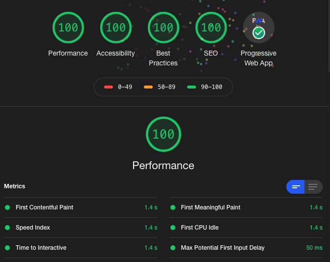

# [gabrielgiordano.com](https://gabrielgiordano.com)

Personal site made with **React** and **Gatsby**, hosted on **GitHub pages**.

Achieves the highest **Lighthouse** scores on reports at production.



Also, this project follows the [Airbnb React style guide](https://github.com/airbnb/javascript/tree/master/react) with also the help of `eslint` and `prettier` configured for such.

## Usage

Use [`yarn`](https://classic.yarnpkg.com/en/docs/install) as the package manager.

Install the dependencies:

```
yarn install
```

Format your code when needed:

```
yarn format
```

Start the development server using:

```
yarn start
```
